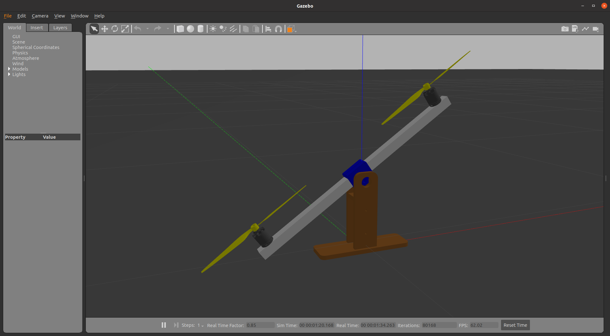
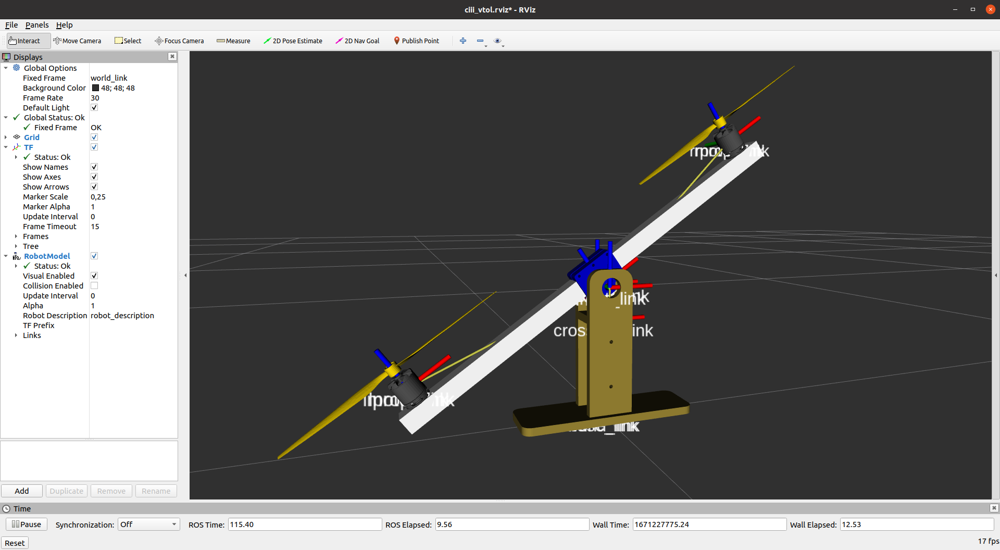

# VTOL de un grado de libertad (1DoF) o balancín

Este repositorio contiene el modelo de simulación de un vehículo/robot VTOL tipo multirrotor de un grado de libertad o balancín.

Para lanzar la simulación ejecutar:
```
> roslaunch vtol_gazebo vtol.launch
> roslaunch vtol_control vtol_control.launch
```

Y para su visualización con RViz:
```
> rosrun rviz rviz -d $(rospack find vtol_description)/rviz/ciii_vtol.rviz
```

**Simulación en Gazebo**             |  **Visualización con RViz**
:-------------------------:|:-------------------------:
  |  
