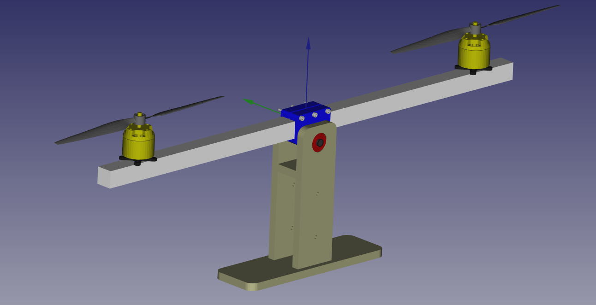

# Archivos de diseño 3D con FreeCAD

La siguiente imagen muestra el ensamble del balancín. El mismo está fabricado con corte láser de MDF e impresión 3D. La barra principl es de aluminio de sección cuadrada de 20x20cm.

El soporte o pie del balancín está fabricado en MDF de 9mm cortado por láser. Los archivos de diseño son:
 * `Base.FCStd`: parte inferior.
 * `Lateral.FCStd`: laterales (x2).
 * `Crossbar.FCStd`: barra transfersal .
 * `CrossbarPote.FCStd`: barra transversal con soporte para potenciómetro.

Los directorios `svg` y `pdf` contienen los archivos para realizar el corte láser de MDF.

El archivo de diseño para impresión 3D es:
 * `AxisSupport.FCStd`: soporte de barra principal.

El directorio `stl` contiene el diseño del soporte de la barra principal en formato STL para su fabricación mediante impresión 3D.

El directorio `assemble` contiene los siguiente archivos:
 * `AxisSupports.FCStd`: ensamble de barra principal con soporte frabicado mediante impresión 3D.
 * `AxisSupportAssemble.FCStd`: idem al anterior incluyendo además los rodamientos y tornillos.
 * `BaseLateralAssemble.FCStd`: ensamble del pie fabricado mediante corte láser en MDF.
